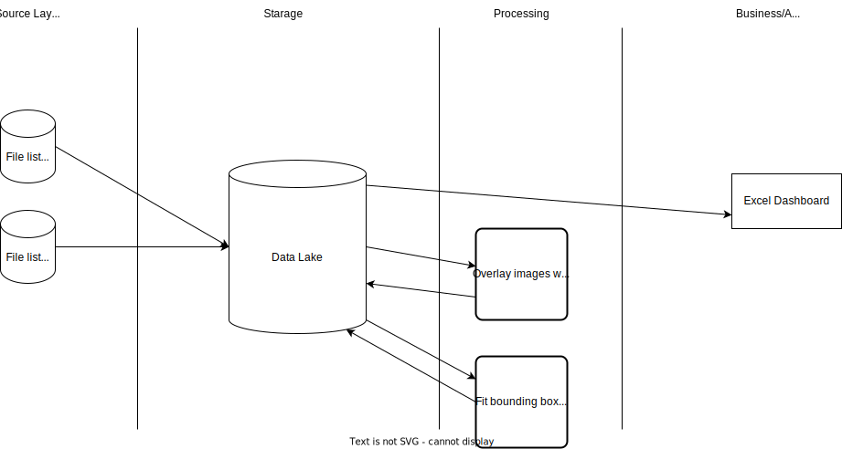

# Homework, La Tarea, for DE-101/module 1

## GitHub install
Git was installed according to the instruction in the lesson. The instruction was read in english. [Documentation](https://git-scm.com/book/en/v2/Getting-Started-About-Version-Control) was postponed for further studying.

For now decided to use GitHub Desktop, but some basic commands in CLI was tested.

## Analytical Solution Architecture

